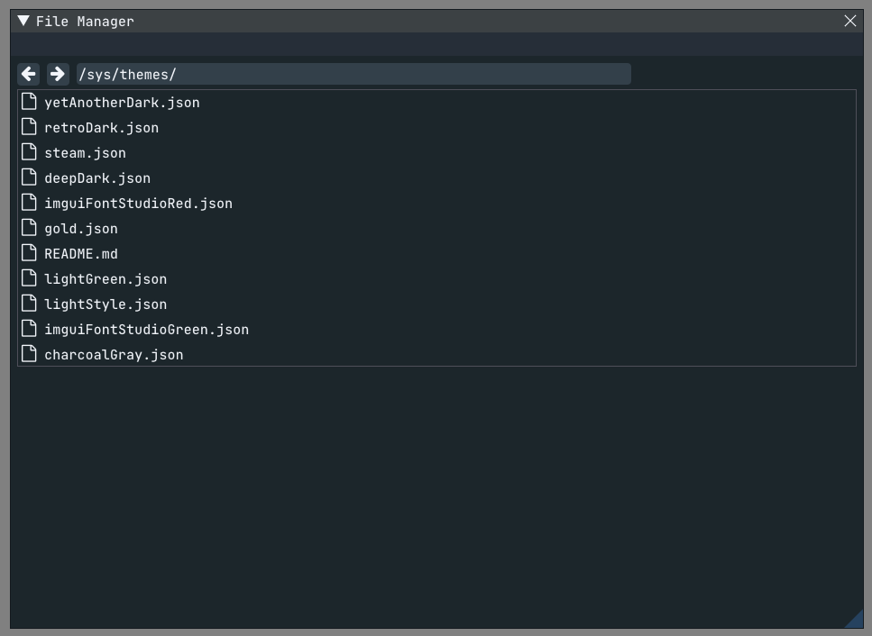
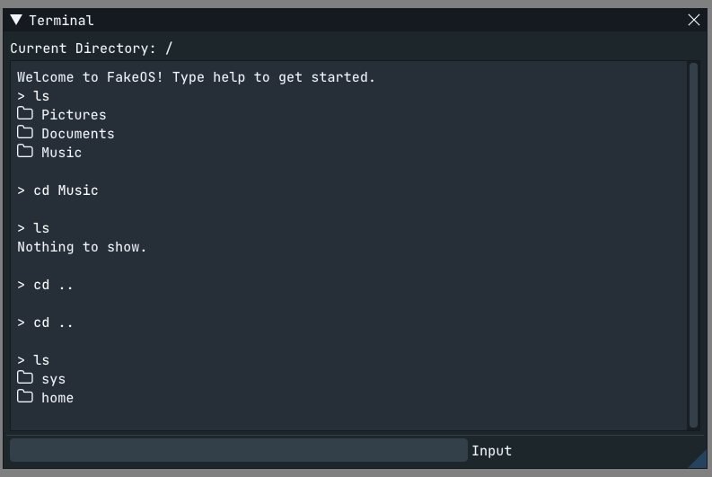
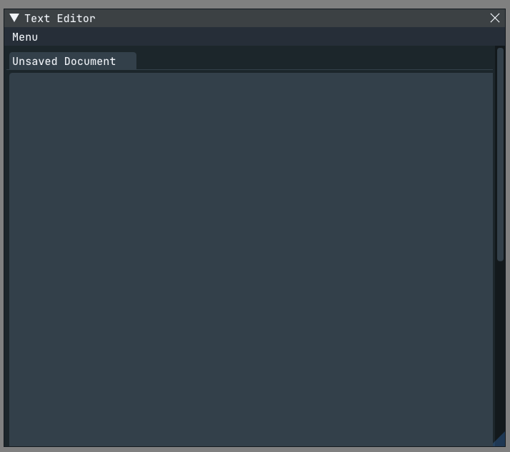

# FakeOS

FakeOS is a project with the goal of providing a fake "operating system". 
Made using C#, Monogame and ImGui with the ImGui.NET plugin.

# State

It currently contains 4 GUI and 5 CLI apps:

Terminal - Lacks any highlighting, finished otherwise.
File Manager - Finished. Could use more features including tree view, renaming files and shift file selection.
Text Editor - Contains unfinished features.
Theme settings - Contains unfinished features.

All CLI apps are finished.

Both GUI and CLI apps can be run via the terminal that appears on startup, type help for more details.

# Gallery

# Credits

Code - @Cuber01 from github.com

Fonts - various people and organizations, see LICENSE for details

Themes - various people, see LICENSE for details